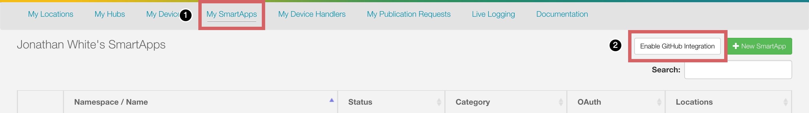
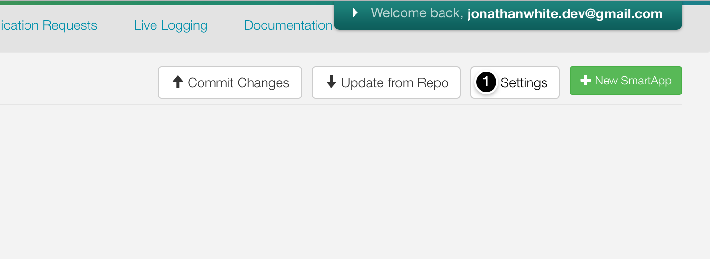
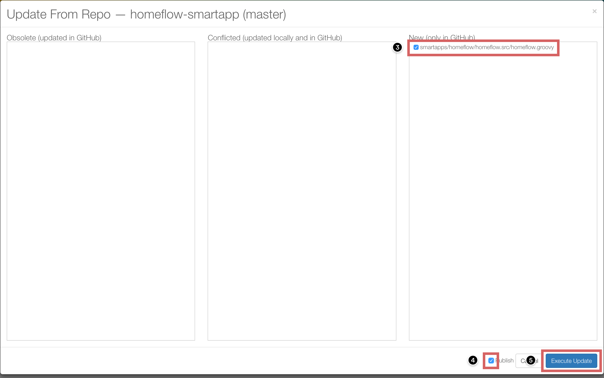
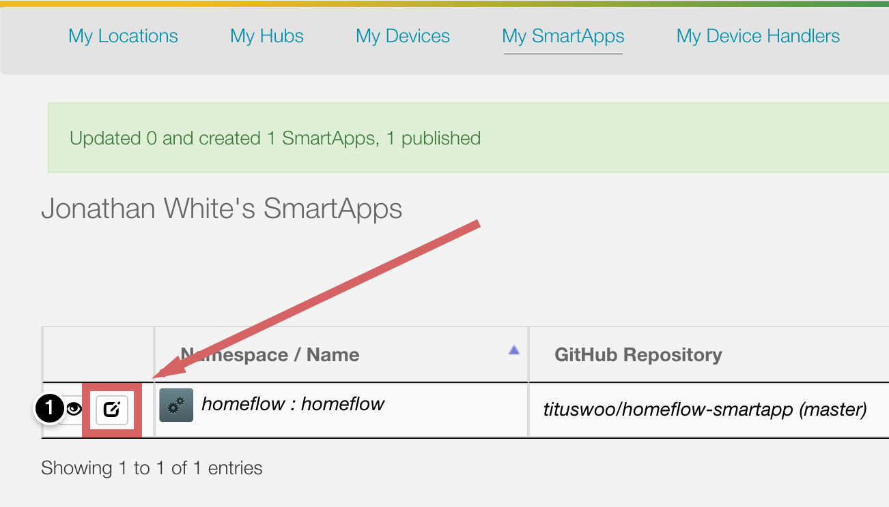
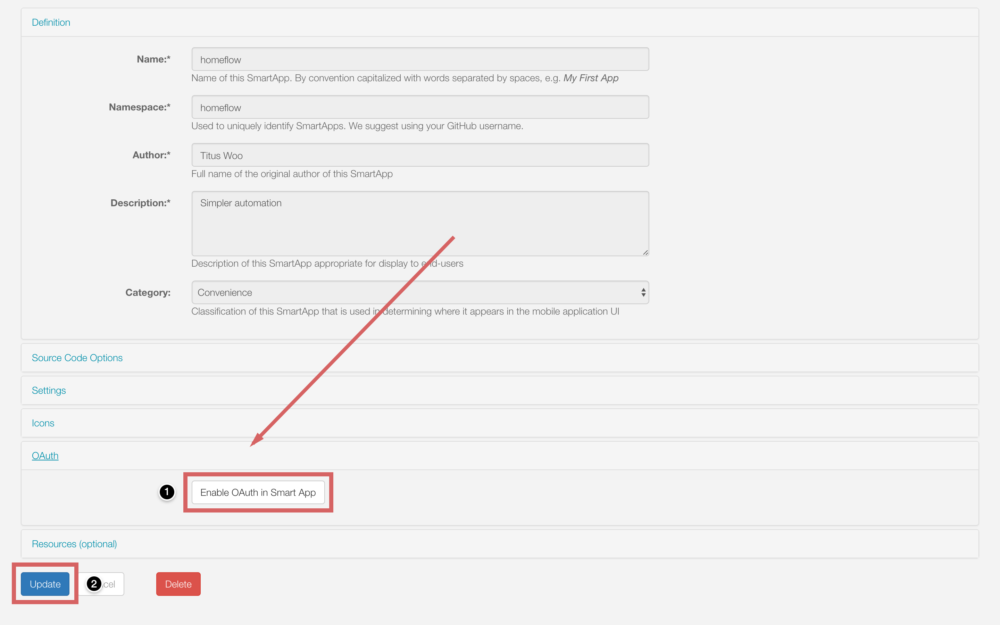
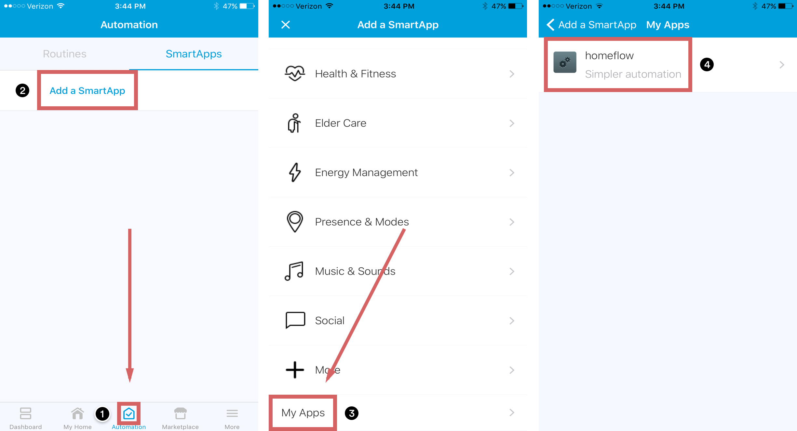
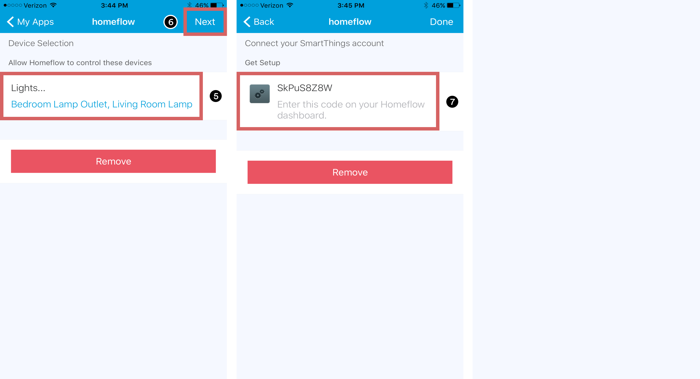
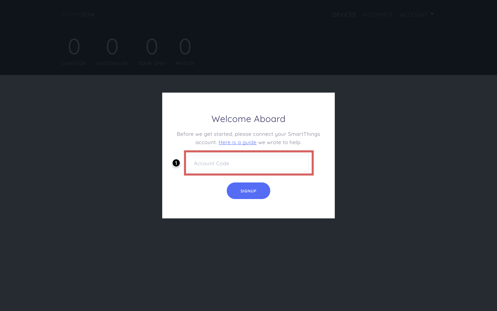

# Homeflow Installation Instructions

#### Integrate with Github
We recommend that you use Github to manage updates and install Homeflow. Github makes getting updates quick and painless.

1. Create an account on Github. Completely free ✨
2. Log into your SmartThings developer dashboard

#### Enable Github integration
1. Click on “My SmartApps” 🤓
2. Click on “Enable Github Integration”
3. Follow the next steps to connect your Github account to SmartThings 👾

#### Post Github integration
1. Click on “Settings” ⚙️

#### Add repository
1. Click on “Add new repository”
2. Owner: tituswoo
3. Name: homeflow-smartapp
4. Branch: master
5. Click on “save” 💾

#### Install Homeflow
1. Click on “Update from Repo” ⬆️
2. Click on “homeflow-smartapp (master)”

3. Click on the checkbox beside “smartapps/homeflow/homeflow.src/homeflow.groovy” ✅
4. Click on the checkbox beside “Publish” (don’t forget this step) ✅
5. Click on “Execute Update” 👌

#### Enable OAuth
Enabling OAuth lets you control your smart devices through Homeflow 🕹
1. Click on the edit icon next to your SmartApp

2. From your “Edit SmartApp” page, scroll down and click “Enable OAuth in Smart App”

3. When the OAuth panel expands to reveal Client ID and Client Secret fields, scroll to the bottom of the page and click “Update” ⚡️

#### Add SmartApp
1. In your SmartThings app, at the bottom, click “Automation”
2. Click on “Add a SmartApp”
3. Scroll to the bottom of the screen and click “My Apps”
4. Select “homeflow”

5. Click and choose the devices you want to control
6. Click on “Next”
7. Enter the code into the Homeflow web app

#### Connect your SmartThings account
1. Enter in the code from your SmartApp to Homeflow

## You’re done 🎉
If you have any questions, or need one-on-one help getting setup, send us an email. jonathanwhite.dev@gmail.com or titus.woo@me.com
